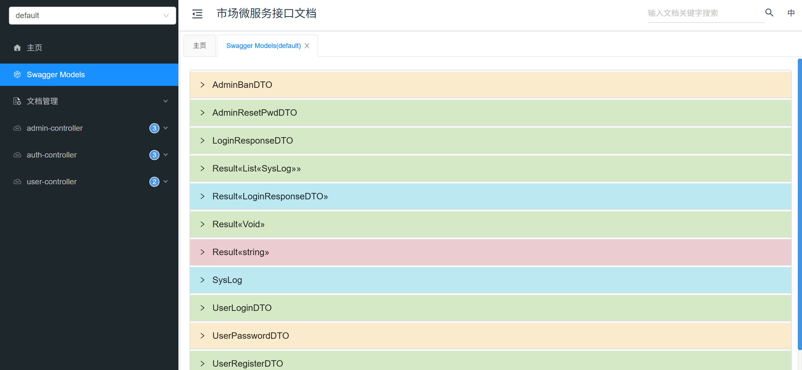
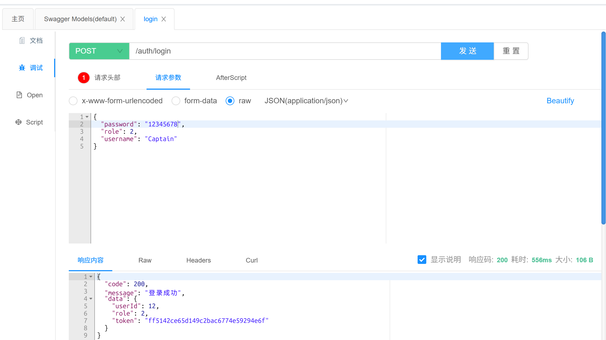
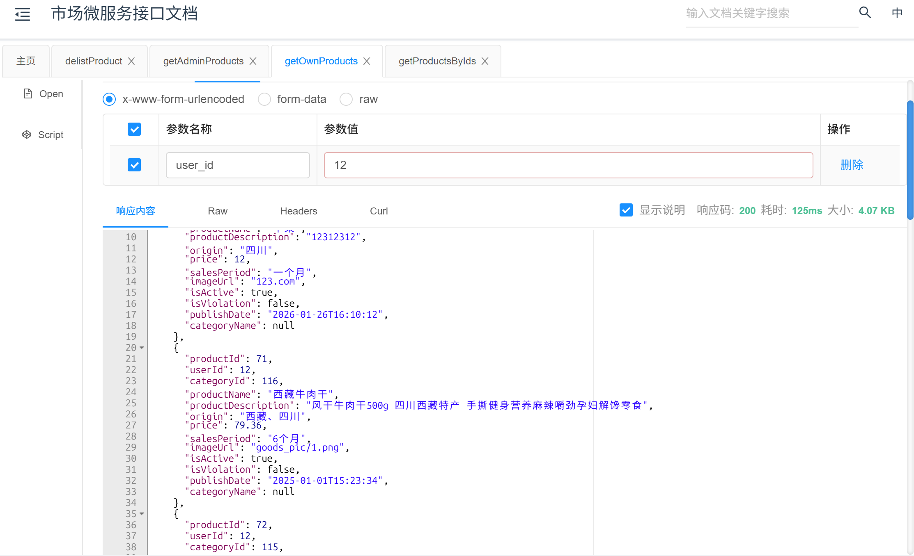
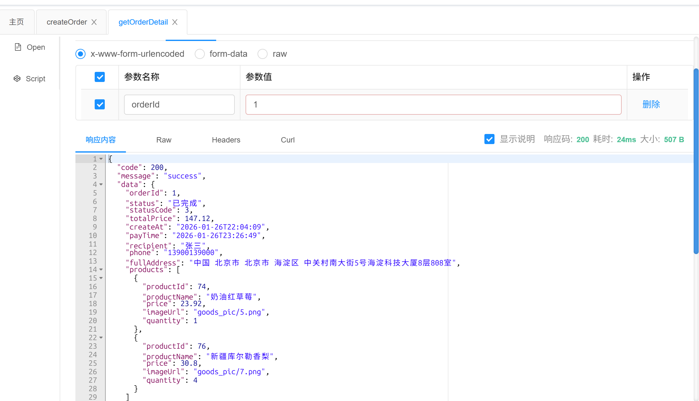

# 🛒 SMarket - 基于 Spring Cloud 的分布式微服务商城系统


## 📖 项目背景 (Background)

随着电子商务的快速发展，单体架构已难以满足高并发、高可用的业务需求。本项目 **SMarket** 旨在构建一个高可用、可扩展的分布式商城系统。

本项目采用 **Spring Boot** 和 **Spring Cloud** 微服务架构进行设计与开发，涵盖了电商核心业务流程，体现了分布式系统的核心设计思想，实现了服务拆分、独立部署与高效通信。

## ✨ 项目目标 (Objectives)

本项目旨在通过实战演练，达成以下核心目标：
- **架构能力**：深入理解微服务架构，掌握服务拆分与治理。
- **技术落地**：熟练运用 Spring 全家桶、MyBatis-Plus、Redis 等主流技术栈。
- **业务分析**：将复杂的电商业务需求（如订单流转、SKU管理）转化为可落地的技术方案。
- **工程素养**：遵循代码规范，具备独立调试、部署及编写文档的能力。

## 🛠️ 技术栈 (Tech Stack)

### 后端架构
| 技术 | 说明 |
| --- | --- |
| **Spring Boot** | 核心开发框架，用于快速构建微服务 |
| **Spring Cloud** | 微服务治理（Nacos 注册/配置中心, Gateway 网关, OpenFeign 调用） |
| **Spring Security + JWT** | 认证与授权，实现无状态的单点登录 (SSO) |
| **MyBatis-Plus** | ORM 框架，简化数据库 CRUD 操作 |
| **Swagger / Knife4j** | API 接口文档自动生成 |

### 数据存储与中间件
| 技术             | 说明                           |
|----------------|------------------------------|
| **MySQL 8.0+** | 关系型数据库，存储业务数据                |
| **Redis**      | 缓存中间件（用于购物车、Token 存储、热点数据缓存） |
| **Docker**     | 容器化部署环境                      |
| **Nacos**      | 微服务注册中心与配置中心                        |

---

## 🧩 核心模块 (Modules)

系统按照业务领域划分为多个微服务模块：

### 1. 👤 用户服务 (User Service)
- **鉴权中心**：基于 JWT 的用户注册、登录、登出。
- **个人中心**：用户个人资料修改、密码重置。
- **权限管理**：基于 RBAC 的角色与权限控制，支持用户禁用/解禁。

### 2. 🛍️ 商品服务 (Product Service)
- **商品管理**：商品增删改查 (CRUD)，支持富文本详情。
- **分类体系**：支持多级商品分类（树形结构）。
- **搜索服务**：基于数据库或 ES 的关键词搜索功能。
- **上下架**：灵活控制商品的销售状态。

### 3. 📦 订单服务 (Order Service)
- **购物车**：使用 Redis 实现高性能购物车（添加、移除、数量调整）。
- **地址管理**：用户收货地址的维护。
- **订单核心**：
    - 订单创建（防重、库存校验）。
    - 订单查询（支持按状态、用户维度查询）。
    - **状态机流转**：`待支付` ➡️ `已支付` ➡️ `已发货` ➡️ `已完成` / `已取消`。
---

## 📂 项目结构 (Project Structure)

```text
SMarket
├── docker-compose.yaml      # Docker 容器编排文件（集成 MySQL, Redis, Nacos）
├── pom.xml                  # Maven 父工程配置文件（依赖版本管理）
├── README.md                # 项目说明文档
├── data/                    # 本地数据挂载目录（包含 MySQL, Nacos, Redis 的持久化数据）
├── market-auth/             # 🔐 认证与用户服务
│   ├── src/main/java        # 包含登录注册、JWT 颁发、用户/管理员管理逻辑
│   └── src/main/resources   # 配置文件 (application.yml)
├── market-product/          # 🛍️ 商品服务
│   ├── src/main/java        # 包含商品 CRUD、多级分类管理、搜索逻辑
│   └── src/main/resources   # 配置文件
├── market-order/            # 📦 订单与购物车服务
│   ├── src/main/java        # 包含购物车(Redis)、收货地址、订单状态流转逻辑
│   └── src/main/resources   # 配置文件
├── market-pay/              # 💳 支付服务（独立模块）
└── market-comment/          # 💬 评价服务（独立模块）
```

---

## 🚀 快速开始 (Getting Started)

### 1. 环境准备

* JDK 17+
* Maven 3.8+
* MySQL 8.0
* Redis 7.0
* Nacos 2.x (推荐 Docker 部署)

### 2. 数据库初始化

请在 MySQL 中创建`smarket`数据库，并执行对应上传的`SQL`。

### 3. 中间件启动

确保 Redis 和 Nacos 已经启动。
*如果是 Docker 环境，请参考根目录下的 `docker-compose.yml`。*

### 4. 配置文件修改

修改各模块 `src/main/resources/application.yml` 或 Nacos 配置中心：

* 修改数据库连接地址、账号密码。
* 修改 Redis 连接地址。
* 修改 Nacos Server 地址。

### 5. 启动服务

建议启动顺序：

1. `Mysql` / `Redis` (中间件)
2. `Nacos` (微服务)
3. `smarket-auth` / `product` / `order` / `pay` / `comment` (业务服务)

### 6. 接口文档

启动成功后，访问网关聚合文档地址：
`http://localhost:网关端口/doc.html` (项目使用了 Knife4j)

---

## 📸 部分效果演示 (Screenshots)
### 登录接口


### 登录成功


### 获取商品


### 获取订单详情

---

## 🤝 贡献与团队 (Team)

本项目由 **廖国涛、林浩晟、汪杨武** 独立开发，其中廖国涛负责**支付模块**的开发，林浩晟负责**用户模块、商品模块、订单模块**的开发，汪武洋负责**评论模块**的开发。

## 

## 📄 版权说明 (License)

MIT License © 2026 SMarket Team
